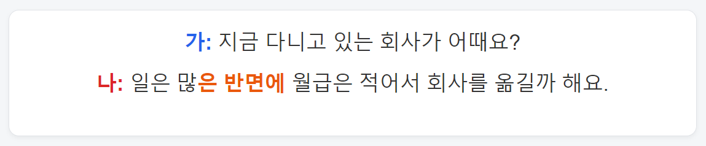
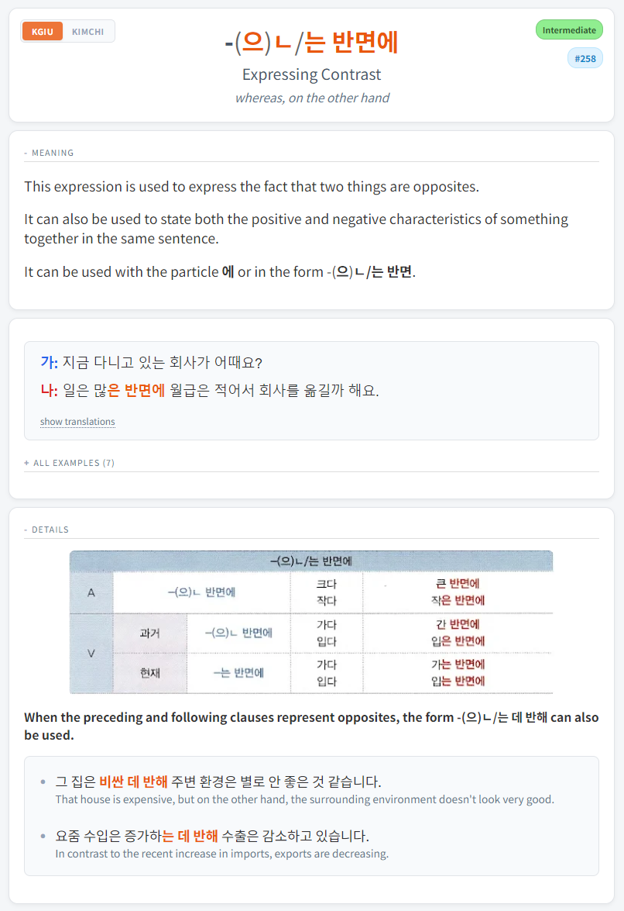

# Korean Anki Decks

## Table of Contents

- [Download](#-download)
- [Korean Grammar Deck](#korean-grammar-deck)
- [Hanja Deck](#hanja-deck)
- [User Configuration](#user-configuration)
  - [Optional Glassmorphism (CSS)](#optional-glassmorphism-css)
- [Credits](#credits)
- [Feedback](#feedback)

##  Download

* **Grammar Deck**: **[Download](https://drive.google.com/file/d/1IjDUYlDbSSAxBu-3a9AWHJZjx8Gl1k4Q/view?usp=drive_link)**
* **Hanja Deck**: **[Download](https://drive.google.com/file/d/1sgeYeMjTg9cCw8v90FMjFrDEMKfFxgL1/view?usp=drive_link)**

### Ankiweb :

- [Grammar Deck](https://ankiweb.net/shared/info/367877479)
- [Hanja Deck](https://ankiweb.net/shared/info/441246030)

If you like the decks and want to show some support, you can rate it on Ankiweb and give the GitHub repo a star, Thank you <3

## Korean Grammar Deck

### Card previews

**Front example**

<table>
  <tr>

  

</tr>

**Back example**
<tr>

  

</tr>
</table>

### Content Sources

- **Korean Grammar in Use (KGIU)**: Complete coverage of all grammar points from Beginner, Intermediate, and Advanced levels
- **Kimchi Reader**: Every grammar points from the Kimchi Reader Grammar section
- **Combined sentence pool**: All example sentences from both sources are included

---

### Card Features

#### Front Side
- Displays a **random example sentence** from the card's sentence pool
- Uses a **randomly selected font** for variety
- Displays the **grammar point with a spoiler** (removed by default on certain early cards to reduce ambiguity for beginners). Note that you can entirely customize the behavior of the grammar point shown on the front (e.g., to have it on top with no spoiler and focus the review on that). For more information, see the [User Configuration](#user-configuration) section.

#### Back Side
- Shows the same randomly selected sentence at the top
- Displays the **focused grammar point and its meaning**
- Lists all other available sentences in the **"All examples"** section

- **Full Korean Grammar in Use lesson content** and **Kimchi Reader content** included in their  respective **Details** section
- Additional sections: **related grammar points** and **comparisons**
- Each card has a **tag indicating its KGIU book level**: *Beginner*, *Intermediate*, or *Advanced*
and **Frequency badge** from Kimchi Reader.
- You can **click on any highlighted grammar point**, which will take you directly to the corresponding **[Kimchi Reader grammar page](https://kimchi-reader.app/grammar)** or **[Korean Grammar in Use page](https://sayhikorean.blogspot.com/2018/10/korean-grammar-in-use-beginner.html)** 

---

### Card Structure

#### One Card Per Meaning
- If a grammar point has **three different meanings**, the deck contains **three separate cards**
- Each card has its own specific set of example sentences

#### Three Types of Cards
1. **Merged**: Grammar points that exist in both KGIU and Kimchi Reader
2. **Korean Grammar in Use only**: Points unique to KGIU
3. **Kimchi Reader only**: Points unique to Kimchi Reader

> 💡 **Tip**: If you want to use **only one source**, you can hide one side on the merged cards and **suspend the "Only" cards** from the source you don't want (see the [User Configuration](#user-configuration) section).

---

### Deck Organization

- **Primary order**: Follows the **Korean Grammar in Use lesson order**
- **Kimchi Reader–only cards**: Mixed into the KGIU lesson order based on:
  - **Frequency** of usage
  - **Relation** to KGIU grammar points

### Study recommendation

My **personal recommendation** is to study **no more than 2–3 new cards per day**, alongside your normal reviews.  
At this pace, you will have seen all the cards in approximately **143–214 days** (**427 cards total**).

If you already know the early grammar points, I recommend going through them **quickly during the first few days** or **suspending them**.

There are many more details about this deck, including **tags, user configuration, structure, and how it was built**.  
For full documentation, see the dedicated README:  
👉 **[Deck README](https://github.com/marbaret/anki-decks/blob/main/korean/grammar/README.md)**
👉 **[How to add examples](https://github.com/marbaret/anki-decks/blob/main/korean/grammar/adding_examples/README.md)**

## Hanja Deck

### Card previews

**Front example**

<table>
  <tr>
    
  </tr>
</table>

**Back example**

<table>
  <tr>
    <td></td>
    <td></td>
  </tr>
</table>

This deck helps build **recognition and understanding of commonly used Hanja**.

---

### Features

- **Multiple sections** that can be easily **enabled or disabled** to suit individual preferences directly in the **card template** (see the [User Configuration](#user-configuration) section below)  

- **Ordered by 한자능력검정 급수** (8급, 7급, etc.)

### Study recommendation

My **personal recommendation** is to study **3–5 cards per day**, alongside your usual reviews.  
At this pace, you will have seen all the cards in approximately **390–649 days** (**1,948 cards total**).

For more details about this deck, including **tags, structure, and how it was built**, see the dedicated README:  
👉 **[Deck README](https://github.com/marbaret/anki-decks/blob/main/korean/hanja/README.md)**

## User Configuration

Both decks include a <strong>USER CONFIGURATION AREA</strong> directly inside the <strong>Front</strong> and <strong>Back</strong> JavaScript of the cards.

This section allows you to customize the deck behavior and appearance (for example: display options, fonts, or other variables) <strong>without touching the core logic</strong>.

Additionally, in the <strong>Styling (CSS)</strong> section, you'll find easily editable variables at the top that allow you to change the appearance of everything.

To modify it:

1. Open Anki
2. Go to <strong>Browse</strong> → select the deck
3. Click <strong>Cards…</strong>
4. Edit the values inside the <strong>USER CONFIGURATION AREA</strong> in the Front and/or Back JavaScript

### Configuration preview

### Optional Glassmorphism (CSS)

The card styling includes an <strong>optional glassmorphism effect</strong> that can be enabled or adjusted directly in the <strong>CSS</strong>.  
It can look great when used with a background image.

To configure it:

1. Open <strong>Cards…</strong> in Anki
2. Go to the <strong>Styling (CSS)</strong> section
3. Delete start and end comment in the first section <em>GLASSMORPHISM OPTION</em>

<strong>How to configure</strong>

<strong>Visual result (with external background)</strong>

## Credits

### Grammar Deck

This deck has been created using the GitHub repo from **[Kimchi Reader's](https://kimchi-reader.app/grammar) grammar section**.  
And all the lesson from Korean Grammar in Use books.

**I strongly encourage you to try out [Kimchi Reader](https://kimchi-reader.app/) !**  
It's the most amazing tool I've used to learn Korean and the best way to build a vocab deck using its sentence mining feature. There is a 1-week free trial, so honestly just give it a try. If you'd like to extend your trial to 1 month, feel free to contact me on Discord and I can provide you with a code : **mathieu.exe**.  

There is an amazing **[Discord server](https://discord.gg/abRkZ2hhSA)** with people who will help you if you have any questions.

- **[Kimchi Reader Grammar page](https://kimchi-reader.app/grammar)**  
- **[Kimchi Reader Grammar GitHub repo](https://github.com/Alaanor/kimchi-grammar)**

**Disclaimer**

I am **not** the creator of Kimchi Reader, and the Grammar page was **not** originally created to serve as a structured language course or a series of lessons.

The [Kimchi Reader Grammar GitHub repo](https://github.com/Alaanor/kimchi-grammar) was created by amazing contributors, and a huge thanks goes to all of them, but keep in mind that there might be some typos or minor issues.  
For every update of the repo, I’ll update the Grammar deck, so you’ll just have to download it again to have the latest version.

If you have the knowledge and time to do so, I really encourage you to **contribute** to the [repo](https://github.com/Alaanor/kimchi-grammar).  
For example, there are points with only **one example sentence**, and it would be amazing to have **multiple examples** for the **random sentence feature** of the deck.

### Hanja Deck

This deck was created by merging **Retro's Hanja deck**, which can be found **[here](https://drive.google.com/drive/folders/1FemoEaheHiJy2eEtTQXGU_bNj8yQipjo?usp=sharing)**  
and another deck that I unfortunately can’t find again on AnkiWeb.  

I also added fields with data scraped from **[Wiktionary](https://en.wiktionary.org/wiki/Wiktionary:Main_Page)**.  

All credits go to Retro and to the creator of the other deck.  

Find **Retro's Blog site** **[here](https://retrolearnskorean.blogspot.com/)**.

## Feedback

If you have any questions, suggestions, or issues, don’t hesitate to contact me on Discord: **mathieu.exe**

I welcome all suggestions and feedback, and I'll do my best to correct any errors you find.

## License

This project is licensed under <strong>Creative Commons Attribution 4.0 International (CC BY 4.0)</strong>.  
See the <code>LICENSE</code> file for full details.
